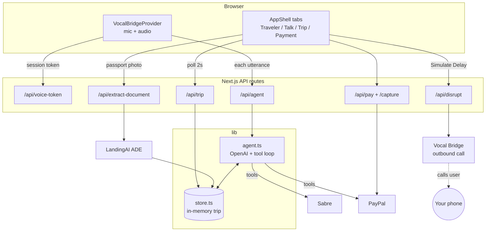

# GUIDIO

**A voice travel concierge that books your whole trip — and calls your phone when it falls apart.**

Guidio is a voice-first travel agent. You talk, it searches real flights and hotels, reads back
options, takes payment, and confirms the booking. Then, when the trip goes wrong, it does the thing
no chatbot can: it *calls you* and rebooks you while you're standing in the terminal.

Built for the DeepLearning.AI **Voice AI Hackathon: The Complete Trip** (Sabre + Vocal Bridge).

---

## The pitch

Booking travel by voice breaks down at two moments, and Guidio is built around both.

**1. Passport numbers are miserable to dictate.**
Reading `X` `9` `2` `M` `4` `K` aloud to a machine is the worst part of any voice booking flow. So
Guidio doesn't ask. The first screen is a document drop zone — scan your passport or ID, and
**LandingAI ADE** extracts the name, number, date of birth, and expiry into the booking before the
conversation even starts. By the time you say hello, Guidio already knows who's flying.

**2. Support disappears exactly when you need it.**
Every travel app is happy to sell you a ticket and then hand you a support queue when the flight is
delayed. Guidio inverts that. On disruption it places an **outbound phone call** through Vocal
Bridge: *"Your American flight to Dallas is delayed — I can get you on AA 1198 at 5:29 AM, shall I
book it?"* You say yes. It swaps the flight, charges the fare difference to PayPal, and reads back
the new confirmation code — entirely by voice, on a phone call you didn't have to make.

That second act is the whole thesis: **not a chatbot — an agent that shows up when it matters most.**

---

## What it does

| Step | What happens | Powered by |
|------|--------------|------------|
| **Traveler** | Scan a passport or ID; details are extracted automatically | LandingAI ADE |
| **Talk** | Speak naturally: "flight from SFO to Dallas next Friday, and a hotel" | Vocal Bridge + OpenAI |
| **Trip** | Real flight and hotel options, searched and priced live | Sabre (test env) |
| **Payment** | Checkout, then a spoken confirmation code | PayPal (sandbox) |
| **Disruption** | Guidio calls your phone and rebooks you by voice | Vocal Bridge outbound |

---

## Architecture

One Next.js app holds both the UI and the API. The browser never sees an API key — every vendor
call is server-side.



### How one spoken turn flows

1. Vocal Bridge captures speech in the browser and transcribes it.
2. `useAIAgent` forwards the text to **`POST /api/agent`**.
3. [`src/lib/agent.ts`](src/lib/agent.ts) runs an OpenAI tool loop with seven tools:
   `search_flights`, `search_hotels`, `save_selection`, `get_trip`, `create_payment`,
   `confirm_booking`, `rebook_next_flight`.
4. Tools hit Sabre/PayPal and mutate the trip in [`store.ts`](src/lib/store.ts).
5. The reply text returns to Vocal Bridge, which speaks it aloud.
6. Meanwhile the UI is polling `/api/trip`, so panels fill in *as you talk*.

### Why the UI polls

The agent mutates trip state server-side, out from under the browser. Rather than pushing updates,
[`TripProvider`](src/lib/TripContext.tsx) polls `/api/trip` every 2s and shares one result with every
panel — so the itinerary, traveler card, and payment state all track the conversation without any of
them owning a timer. Swapping this for SSE is the obvious upgrade.

### Search results are pinned server-side

Models are unreliable at echoing back exact identifiers. So `search_flights` caches its results per
session, and `save_selection` resolves the user's choice against *that* cached list by id — never
against JSON the model reproduced. This is what stops "book the 8:15" from booking the wrong flight.

### The call survives tab switches

The voice widget is mounted once in [`AppShell`](src/components/AppShell.tsx) and merely *hidden*
when you move to another tab. Unmounting `VocalBridgeProvider` would tear down the live call
mid-sentence, so you can browse your itinerary while still talking.

---

## Project structure

```
src/
  app/
    page.tsx                     # shell + header
    layout.tsx                   # fonts, metadata, dark colour scheme
    globals.css                  # black/yellow theme + orb keyframes
    api/
      voice-token/route.ts       # mint a Vocal Bridge browser session token
      agent/route.ts             # the brain: utterance in, spoken reply out
      extract-document/route.ts  # passport/ID photo -> traveler details
      flights/search/route.ts    # Sabre flight search
      hotels/search/route.ts     # Sabre hotel search
      trip/route.ts              # current trip state (polled by the UI)
      pay/route.ts               # PayPal create order
      pay/capture/route.ts       # PayPal capture order
      book/route.ts              # confirm booking -> confirmation code
      disrupt/route.ts           # DEMO trigger -> outbound disruption call
      rebook/route.ts            # swap flight + charge fare difference
  components/
    AppShell.tsx                 # tabbed shell; keeps the call alive across tabs
    UserDetailPanel.tsx          # landing screen: passport/ID drop zone
    VoiceWidget.tsx              # orb, live transcript, call controls
    Orb.tsx                      # ambient animated ring (pure CSS)
    TripDashboard.tsx            # TripStatus / TripSummary / PaymentPanel / DemoControls
    TripProgress.tsx             # Traveler -> Trip -> Payment -> Confirmed
    ui/Section.tsx               # shared card
  lib/
    agent.ts                     # OpenAI tool loop + system prompt
    sabre.ts  paypal.ts  landingai.ts  vocalbridge.ts   # vendor clients
    booking.ts                   # disruption rebooking (flight swap + fare difference)
    store.ts                     # in-memory trip state
    TripContext.tsx  useTrip.ts  # shared polling + stage logic
```

---

## Stack

- **Next.js 16** (App Router, TypeScript, Tailwind v4) — one app, UI + API
- **Vocal Bridge** — browser voice agent *and* outbound phone calls
- **OpenAI** (`gpt-4o`, override with `OPENAI_MODEL`) — reasoning + tool calling
- **Sabre** (test environment) — real flight and hotel inventory
- **PayPal** (sandbox) — checkout and fare-difference charges
- **LandingAI ADE** — passport/ID image → structured traveler data

---

## Getting started

```bash
npm install
cp .env.example .env.local   # fill in your keys
npm run dev                  # http://localhost:3000
```

### Environment

All keys are server-side only; `.env.local` is gitignored.

| Variable | Purpose |
|----------|---------|
| `VOCALBRIDGE_API_KEY`, `VOCALBRIDGE_AGENT_ID` | Web voice + outbound calling |
| `SABRE_CLIENT_ID`, `SABRE_CLIENT_SECRET`, `SABRE_PCC` | Flight/hotel search |
| `PAYPAL_CLIENT_ID`, `PAYPAL_CLIENT_SECRET` | Checkout |
| `PAYPAL_SIMULATE=1` | Create real orders but simulate capture, so the demo never blocks on a sandbox login |
| `LANDINGAI_API_KEY` | Passport extraction |
| `OPENAI_API_KEY` | The agent brain |
| `DEMO_USER_PHONE` | E.164 number the disruption call dials |

---

## Demo script

1. **Traveler tab** — drop in a passport photo; the fields populate themselves.
2. **Talk tab** — "Start talking." Ask for a flight from SFO to Dallas next Friday.
   Guidio asks how many are travelling and whether you want a hotel, then reads back options.
3. Pick one out loud — the **Trip** tab fills in live while you're still talking.
4. **Payment tab** — pay, and Guidio reads the confirmation code back to you.
5. **Trip tab → Simulate Delay** — put the laptop down. *Your phone rings.* Rebook by voice.

---

## Demo-build caveats

This was built in a hackathon window, so a few things are deliberately simple:

- **Trip state is in-memory.** [`store.ts`](src/lib/store.ts) is a `Map` that lives for the lifetime
  of the dev server — restarting it wipes an in-progress demo. There is no database.
- **Single trip.** Everything is keyed to one hardcoded `DEMO_TRIP_ID` (`"demo"`), shared by the
  voice session and the UI. No multi-user support.
- **Disruption is a button,** not a real airline feed — so the demo never depends on real-world
  timing.
- **Search is real; booking is not.** Flight and hotel *search* hits the live Sabre test
  environment, but `createBooking()` in [`sabre.ts`](src/lib/sabre.ts) generates a Sabre-style
  6-character locator locally — no PNR is created and nothing is ticketed. Swapping it for a real
  create-PNR call is the one change needed to make bookings genuine.
